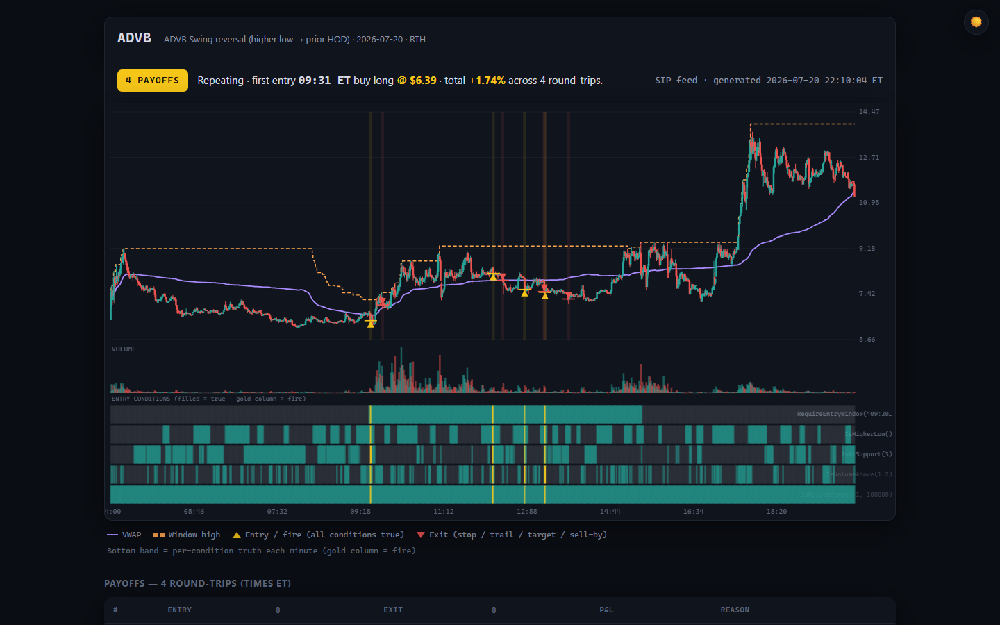
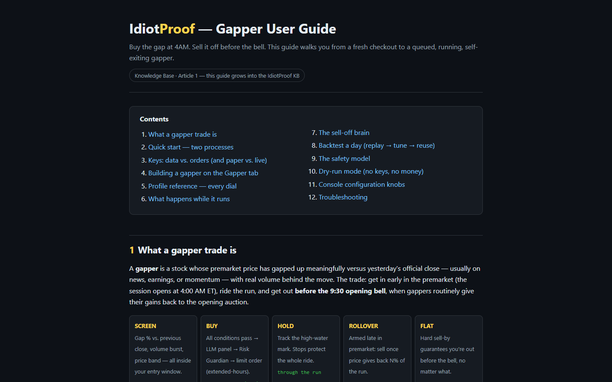
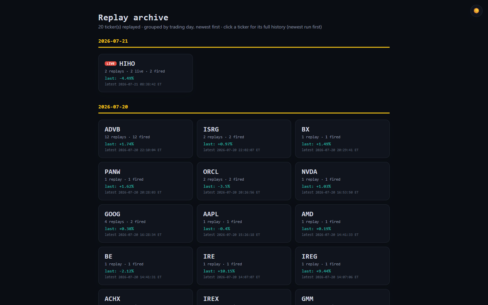

# IdiotProof

Describe a trade in plain English and IdiotProof turns it into a strategy that a 24/7 Monitor evaluates against live market data, firing only when its conditions, an LLM panel and a risk guard all agree.

[](https://dotnet.microsoft.com/) [](https://learn.microsoft.com/aspnet/core/blazor/) [](https://learn.microsoft.com/sql/database-engine/configure-windows/sql-server-express-localdb) [](https://alpaca.markets/) [](docs/BIBLE.md)



Try it: browse the public replay archive at [mindattic.com/idiotproof/replays](https://mindattic.com/idiotproof/replays/), where every published run shows the chart, the condition truth bands and each round-trip's P&L.

## Why

- Describe your edge the way you would say it out loud, for example "if NVDA pulls back to the 9 EMA in an uptrend with volume confirmation, go long with a 1% stop", and get a real, runnable strategy back.
- Stop watching charts at 4 AM. A standalone console re-reads every active strategy from SQL about once a second and acts on it while you sleep.
- No single point of failure on the money path: the strategy conditions, a multi-LLM voter quorum and the Risk Guardian must all agree before an order is placed.
- You cannot route real capital by accident. The Sandbox broker is the default, paper is the next step, and live trading needs an explicit per-strategy choice and a red confirmation modal.
- See exactly why something fired or did not: per-condition progress (`4/5 — waiting on OnReclaim(9)`) is live in the UI, and every signal, veto and order lands in the audit log.
- Your strategies stay yours: SQL-backed, owned per user, broker keys encrypted, full audit trail.

## Features

### Three ways to author a strategy

- Guided: a visual flowchart editor with one card per lifecycle phase.
- Script: write IdiotScript, the project's fluent C# DSL, directly.
- Describe: type plain English; `StrategyScriptGenerator` sends it to Claude through `MindAttic.Legion` (a single call), with a verb catalog built by reflecting on the real DSL types so a model cannot invent syntax that does not compile, and the result is parse-checked.

Strategies are stored as canonical strict JSON. If a stored strategy cannot be read exactly, it is quarantined with a visible reason instead of being partially evaluated.

### The Gapper

The flagship flow: buy a premarket gap at 4 AM ET, sell it before the 9:30 bell once momentum rolls over. Queue a ticker on the Gapper tab, pick a profile, dial in gap %, volume, price band, stops, peak-giveback and arm/sell-by times, and the Monitor handles the rest. You can also paste a video transcript and let `GapperInterpreter` extract candidate plays as review cards; nothing queues until you click.



### Three gates before money moves

1. All strategy conditions match.
2. The LLM voter quorum explicitly approves.
3. The Risk Guardian clears stop presence, per-trade and daily loss limits, stop distance and account-risk percent.

Any gate can block the fire, and the reason goes to the audit log.

### Replay archive

The Monitor can replay a strategy over a past day (`replay`, `replay-all`, `scan`) and render each run as a static HTML page: minute candles, VWAP, entry and exit markers, a per-condition truth band and a payoffs table. `replay-regen` rebuilds the archive from the `ReplayRun` rows in SQL, and it is published by hand to [mindattic.com/idiotproof/replays](https://mindattic.com/idiotproof/replays/).



### Research, options and learning

- Research tab: a ranked feed of high-impact events from SEC filings, Alpaca news and Federal Register notices, scored 0 to 100 by the separate Research Scanner.
- Options tab: a manual options section with a full chain, per-strike breakeven, an intrinsic versus extrinsic ("real vs hype") meter and a plain-English order ticket. It is deliberately separate from the automated strategy pipeline.
- Learning Center: seeded articles with live-rendered strategy examples embedded through `[[...]]` wikilinks.
- Backtesting: `StrategyBacktester` and the gapper day replay run the same evaluation code as the live Monitor.

## Quick start

The system is two .NET processes sharing one SQL database; the database is the communication channel. Anything you change in the UI is picked up by the console on its next pass, roughly a second later, with no restart. The full field-by-field walkthrough is in [user-guide.htm](IdiotProof.Blazor/wwwroot/user-guide.htm), which the running app also serves at `/user-guide.htm`.

Prerequisites: .NET 10 SDK, SQL Server LocalDB (ships with Visual Studio or the SQL Server Express LocalDB package), and Node 18+ only if you want to run Cypress.

### Step 1 build and create the database

```bash
git clone https://github.com/mindattic/IdiotProof.git
cd IdiotProof
dotnet build IdiotProof.slnx
dotnet ef database update --project IdiotProof.Blazor
```

### Step 2 start both processes

```bash
# Terminal 1 — the web UI (https://localhost:5001)
dotnet run --project IdiotProof.Blazor

# Terminal 2 — the trading console
dotnet run --project IdiotProof.Monitor
```

Both default to the same LocalDB database (`IdiotProof`). The console prints a startup banner, acquires the SQL leader lease and starts ticking. Register an account in the UI on first run. On a plain Debug build the web app needs a `wwwroot` folder next to the built exe; see [Limitations and roadmap](#limitations-and-roadmap).

### Step 3 real market data

The console picks its data feed from the settings chain. Put Alpaca keys in the MindAttic broker keyring at `%APPDATA%\MindAttic\Brokers\providers.json`:

```json
{ "alpaca-paper": { "type": "alpaca", "apiKey": "PK...", "secret": "..." } }
```

Or set `AlpacaApiKeyId` and `AlpacaApiSecretKey` before starting the Monitor. With keys present the Monitor uses Alpaca REST plus a live websocket stream (real-time SIP tape by default); without keys it falls back to a deterministic mock feed.

### Step 4 real order routing

In the UI open the user menu, then API Keys. Enter your Alpaca key and secret, leave Paper checked, enable "Route my orders to this Alpaca account" and Save All. The console decrypts those keys through the shared ASP.NET Core Data Protection key ring and places your orders on your account. Without the toggle, orders go to the built-in Sandbox broker (simulated fills), the safe default by design. Live trading means unchecking Paper and confirming the red modal; each strategy's own `BrokerMode` (Paper, Live or Sandbox) then overrides the global flag for that strategy.

### Step 5 queue a gapper

- From a transcript: paste a video transcript or any natural language into the Gapper tab's "From a transcript" box and press Interpret. Claude, through Legion and `GapperInterpreter`, extracts the gap plays as reviewable candidate cards with inferred dial-ins. Queue the ones you like, or Load into dials to tweak first.
- By hand: enter a ticker, pick a profile from `IdiotProof.Blazor/wwwroot/data/gapper-profiles.json`, dial in gap %, volume, price band, SL/TSL, peak-giveback and arm/sell-by times, then Queue Gapper.

From then on it is hands-off. The Monitor screens the ticker every pass in the 4:00 to 9:00 AM ET premarket window, buys through the three gates when the criteria hit (premarket orders are limit plus extended-hours automatically), shows HOLDING qty @ price live, and sells before the 9:30 bell: momentum giveback first, hard sell-by as the backstop.

### Step 6 watch it or dry-run it

The console log narrates every decision; the Gapper and Strategies tabs mirror it live. To rehearse without keys or money, start the Monitor with `IDIOTPROOF_FEED=mock`, queue a ticker starting with GAP (for example `GAPT`, for which the mock feed fabricates a gap day) and leave routing off. The session gate still runs on the real ET clock, so entries only fire during actual premarket hours, Monday to Friday. The Monitor also refuses to place a real order against mock market data even if a broker is configured.

## How it works

Data flows one way from market data down to an order; audit and state flow back up through SQL to every UI that is watching.

```text
                                ┌───────────────────────────────┐
                                │        Trader (browser)        │
                                └───────────────┬─────────────────┘
                                                │
                              ┌─────────────────▼──────────────────┐      ┌─────────────────────┐
                              │          IdiotProof.Blazor          │◄─────┤   Cypress E2E       │
                              │  Strategies · Strategy Builder      │      │ (9 specs, tests/)   │
                              │  (Guided / Script / Describe)       │      └─────────────────────┘
                              │  Gapper · Learn · Research          │
                              │  Options · Backtest · API Keys      │
                              └─┬──────────┬─────────────┬──────────┘
                                │          │             │
                       ┌────────▼──┐ ┌─────▼─────┐ ┌─────▼───────────┐
                       │StrategyBu-│ │ Wikilink  │ │StrategyScript-  │
                       │ilderRend- │ │ Parser    │ │Generator        │──► MindAttic.Legion
                       │erer       │ └───────────┘ │(reflects verb   │    (voter panel, legion.json)
                       └─┬─────────┘               │catalog, sends  │───►┌──────────────────┐
                         │                          │to Claude/GPT/  │    │ %APPDATA%\       │
                         │                          │Gemini/DeepSeek)│    │ MindAttic\LLM\   │
                         │                          └────────────────┘    │ providers.json   │
                         │                                                └──────────────────┘
              ┌──────────▼──────────────────────────┐
              │           IdiotProof.Engine          │
              │  AppSettings (disk→env→Vault→config) │
              │  ServiceRegistration · SupervisedLoop │
              │  AuditLogger · WorkspaceManager       │
              └─┬───────────┬───────────┬─────────────┘
                │           │           │
          ┌─────▼───┐  ┌────▼─────┐ ┌───▼─────────────────┐
          │ Models  │  │Indicators│ │     Scripting        │
          │ (nouns) │  │ RSI EMA  │ │  IdiotScript DSL,     │
          │         │  │ ATR MACD │ │  StrategyBuilder,     │
          │         │  │ VWAP ... │ │  ScriptParser,        │
          │         │  │          │ │  GapperProfile,       │
          │         │  │          │ │  TradingSchedule (ET) │
          └────┬────┘  └────┬─────┘ └──────────┬────────────┘
               │            │                   │
          ┌────▼────────────▼───────┐   ┌───────▼─────────────┐
          │       Shared            │   │     Strategies       │
          │  RiskGuardian (final    │   │  IStrategy·DslStr-    │
          │  veto) · IndicatorSnap  │   │  ategy·IndicatorSnap- │
          └────┬─────────────────── ┘   │  shotBuilder·Gapper-  │
               │                        │  ExitEvaluator·       │
               │                        │  StrategyBacktester   │
               │                        └──────────┬────────────┘
               │                                   │
          ┌────▼──────────────┐          ┌─────────▼────────────┐
          │   DataFeeds        │         │      Brokers          │
          │ IMarketDataFeed:    │        │ IBrokerClient:         │
          │  AlpacaDataFeed     │        │  AlpacaBrokerClient    │
          │  (REST, sip/iex)    │        │  SandboxBrokerClient   │
          │  AlpacaStreamingCl- │        │  BrokerRouter          │
          │  ient (websocket)   │        │  (Sandbox is always    │
          │  MockDataFeed       │        │   the safe default)    │
          │  SwitchableFeed     │        └────────────────────────┘
          └────────┬───────────┘
                   │
          ┌────────▼──────────────────────────────────────────┐
          │                SQL Server (LocalDB)                 │
          │                  IdiotProof database                 │
          │  Strategies · UserPreferences · ConditionProgress    │
          │  UserApiKeys · AuditLogs · Workspaces · LiveBars      │
          │  ResearchClaim · TrackedTicker · TradeDiaryEntry ...  │
          └────────▲───────────────────────────────────┬─────────┘
                   │                                   │
        ┌──────────┴───────────┐             ┌─────────▼──────────────┐
        │  IdiotProof.Monitor    │            │  IdiotProof.ResearchSc- │
        │  (console, 24/7)       │            │  anner (one-shot,       │
        │  evaluates → 3 gates   │            │  Scheduled-Task-fired)  │
        │  → order → exit mgmt   │            └─────────────────────────┘
        └────────────────────────┘
```

IdiotProof is one solution with several front doors and one shared engine:

- `IdiotProof.Blazor` is a Blazor Server web app where a trader authors strategies, watches them live, and manages accounts, keys and research.
- `IdiotProof.Monitor` is a standalone console that runs unattended, loads every active strategy from SQL, evaluates it continuously, walks the three gates, places orders and manages open positions to their exit.
- `IdiotProof.ResearchScanner` is a one-shot console, meant for a Scheduled Task rather than a daemon, that sweeps EDGAR filings, Alpaca news and Federal Register notices and writes scored events to the same database for the `/research` tab.

Everything shares one SQL database as the single source of truth, one settings and credential overlay chain (`IdiotProof.Engine.Settings.AppSettings`), and the same domain libraries, so a strategy is evaluated identically everywhere.

Reading the diagram:

1. A trader authors a strategy in `IdiotProof.Blazor`. It is saved to the `Strategies` table as canonical strict JSON (`ScriptJson`), with IdiotScript text (`ScriptText`) kept only as a human-readable view; see [IP-LAW-8](docs/BIBLE.md#IP-LAW-8).
2. `IdiotProof.Monitor` re-reads every `IsActive = true` row on every pass, builds an `IndicatorSnapshot` per symbol from live candles (`IdiotProof.Indicators` math over `IdiotProof.DataFeeds` data), and walks each strategy's entry conditions.
3. A full pass on all conditions is a candidate signal, not an order. It must still clear the LLM voter panel and the `RiskGuardian` (`IdiotProof.Shared.Risk`) before `IdiotProof.Brokers` places anything.
4. Every step (condition progress, votes, vetoes, fills, exits) is written back to SQL (`ConditionProgress`, `AuditLogs`, `LiveBar`), which the Blazor UI polls for live badges without any direct connection to the Monitor.
5. `IdiotProof.ResearchScanner` is architecturally separate: it never touches strategies or orders, it only populates `ResearchClaim` and `TrackedTicker` rows that the `/research` page reads.

It is Alpaca-only in the active build. A new broker plugs in by implementing `IBrokerClient` and registering it with `BrokerRouter`.

## Projects

Every project below is registered in `IdiotProof.slnx`.

| Project | Type | Responsibility | Key types |
|---|---|---|---|
| `IdiotProof.Models` | Class library | Domain DTOs and enums, the nouns everything else shares. | `Candle`, `TradeSignal`, `TradeSetup`, `OrderRequest`/`OrderResult`, `Position`, `TradeDirection`, `TradingSession`, `BrokerType {Alpaca, Sandbox}`, `StrategyType`; options: `AssetClass {Equity, Option}`, `OptionRight`, `OptionContract` (OCC parse/build), `OptionQuote`, `OptionGreeks` |
| `IdiotProof.Shared` | Class library | Cross-cutting primitives used by almost every other project. | `RiskGuardian` (+ `RiskGuardianConfig`/`Result`), the final pre-trade veto; `IndicatorSnapshot`; `LogMessage`; `SettingsMetadata`; `Branding` (console banner); `Options/`: `IntrinsicValueCalculator` (real vs hype split, breakeven, DTE), `BlackScholesCalculator` (theoretical price + implied-vol solver), `SellSignalEvaluator` (informational "consider taking profit") |
| `IdiotProof.Indicators` | Class library | Pure indicator math, no I/O. | `ADX`, `ATR`, `BollingerBands`, `CCI`, `EMA`, `MACD`, `Momentum`, `OBV`, `RSI`, `SMA`, `Stochastic`, `VWAP`, `WilliamsR`, `CandlestickPatterns` |
| `IdiotProof.Scripting` | Class library | The IdiotScript DSL: authoring, parsing, serializing, scheduling. | `IdiotScript`/`StrategyBuilder`/`Conditions` (fluent authoring), `ScriptParser` (tolerant text to model), `StrategyJson` (canonical strict-JSON codec), `StrategyLoader` (fail-closed load), `StrategyHtml` (render), `GapperProfile` (dialable template), `EmaPeriodCollector`, `TradingSchedule`/`MarketTime` (ET session clock) |
| `IdiotProof.Strategies` | Class library | Turns a parsed definition into something evaluatable and testable. | `IStrategy`, `DslStrategy` (adapter), `IndicatorSnapshotBuilder`, `StrategyBranchResolver` (If/ElseIf/Else), `GapperExitEvaluator` (sell-by/stop/target/peak-giveback), `GapperDayBacktester`, `Backtesting/StrategyBacktester` + `BacktestReport` |
| `IdiotProof.DataFeeds` | Class library | Market data abstraction and providers. | `IMarketDataFeed` (+ default `GetPreviousCloseAsync`), `AlpacaDataFeed` (REST, sip/iex), `AlpacaStreamingClient` (websocket trades + minute bars), `MockDataFeed` (deterministic gap simulation), `SwitchableMarketDataFeed` |
| `IdiotProof.Brokers` | Class library | Order routing abstraction and providers. | `IBrokerClient` (equity members + default-implemented options members: `SupportsOptions`, `GetOptionTradingLevelAsync`, `GetOptionChainAsync`, `GetOptionQuotesAsync`), `AlpacaBrokerClient` (orders, positions, account, option contracts, option snapshots, single-leg option orders), `AlpacaOAuthClient`, `SandboxBrokerClient` (in-memory fills + a synthetic options chain), `BrokerRouter` (Sandbox always registered as the safe fallback) |
| `IdiotProof.Engine` | Class library | The DI root shared by every host. | `ServiceRegistration.AddIdiotProofEngine(...)`, `Settings/AppSettings` (disk, env, MindAttic keyrings, `IConfiguration` overlay chain), `Storage/IStorageProvider`/`StorageLocation`, `SupervisedLoop` (fault-tolerant tick loop with backoff + heartbeat), `AuditLogger`, `Workspace/WorkspaceManager` + `JsonFileWorkspaceStore` (legacy JSON path; the Blazor host swaps in a SQL-backed store) |
| `IdiotProof.Blazor` | ASP.NET Core Blazor Server app | The primary web front door: strategy authoring and monitoring, accounts, keys, research, learning. | See [The web app](#the-web-app) |
| `IdiotProof.UI` | Razor Class Library | Shared component library referenced by `IdiotProof.Blazor`. Presentational only. | `Components/Options/`: `OptionsChainView`, `OptionOrderTicket`, `OptionPositionTracker`, `OptionsLiveElevationModal`, `OptionsPresenter` + view models; `Components/Shared/`: `Tooltip`, `Term`; `wwwroot/css/options.css`, tooltip CSS and JS |
| `IdiotProof.Monitor` | .NET generic host console, Windows-Service-ready | The 24/7 evaluator and executor, "the one pipeline". | `Program.cs` (composition root), `MonitorWorker` (the tick loop), `MonitorLeaderLease` (`sp_getapplock` single-instance lease), `MonitorCli` (operator subcommands), `AutoGapperScanner`, `PremarketFadeScanner`, `EmailSmsAlertSender`, `StrategyScanner`/`StrategyReplay`/`StrategyReplayLive`/`ReplayFeatures`/`ReplayTemplates`/`StrategyDataset` (offline replay and ML-dataset tooling) |
| `IdiotProof.ResearchScanner` | One-shot console | Autonomous market-event research sweep; not a daemon, not part of the trading loop. | `Program.cs`, `ScanPassRunner` |
| `IdiotProof.Engine.Tests` | NUnit | RiskGuardian gate, SupervisedLoop resilience, WorkspaceManager, options pricing math (OCC, intrinsic/extrinsic, Black-Scholes, IV round-trips, sell signal). | — |
| `IdiotProof.Indicators.Tests` | NUnit | RSI/EMA/ATR/MACD/VWAP math + ADX Wilder-seed regression. | — |
| `IdiotProof.Strategies.Tests` | NUnit | DSL round-trip, backtester, gapper lifecycle, canonical-JSON contract, and a large family of exhaustive combinatorial matrix tests. | — |
| `IdiotProof.Brokers.Tests` | NUnit | BrokerRouter Sandbox default and safe fallback, Sandbox fill simulation, Sandbox synthetic options chain, Alpaca options wire format against canned responses. | — |
| `IdiotProof.Blazor.Tests` | NUnit | `StrategyScriptGenerator` verb-catalog reflection, the LLM gate on Legion's voter panel (`LlmVotingServiceTests`) and per-owner Claude keys and their isolation (`UserClaudeKeyResolverTests`, `ClaudeKeyIsolationTests`), the password-reset flow (`PasswordResetFlowTests`), research-pipeline services, repository guard rails. | — |
| `IdiotProof.Monitor.Tests` | NUnit | Long and short order shapes on the Sandbox broker (`DirectionalOrdersTests`), `PremarketFadeScanner` and `BeBexDecayScanner` math. | — |
| `IdiotProof.UI.Tests` | NUnit | Options presenter, option position view and options glossary. | — |
| `tests/IdiotProof.Cypress` | Cypress 13 | End-to-end Blazor UI tests (9 specs). | — |

`docs/BIBLE.md` section 3 records older trees (`IdiotProof.Core`, `IdiotProof.Cli`, `src/`) as deleted on 2026-06-07.

## Domain model

Nouns (`IdiotProof.Models`, `IdiotProof.Shared`):

- `Candle`: one OHLCV bar.
- `TradeSignal`: the output of `IStrategy.Evaluate`, a candidate to fire.
- `TradeSetup` and `RiskLimits`: decimal-priced inputs that `RiskGuardian` validates.
- `OrderRequest`, `OrderResult`, `Position`: the broker-facing order lifecycle.
- `StrategyDefinition` (`IdiotProof.Scripting`): a parsed strategy of phases, conditions and branches.
- Enums in `IdiotProof.Models/Enums.cs`: `TradeDirection {Long, Short}`, `TradingSession {Premarket, RTH, AfterHours, Extended}`, `OrderType`, `OrderSide`, `PriceType`, `ConfidenceGrade`, `BrokerType {Alpaca, Sandbox}`, `StrategyType {Iti, BreakoutPullback, LowHigh, FluentDsl, Custom}`, `WorkspaceState`.

Verbs (the key services, by call site):

- `Stock.Ticker(symbol)` returns a `StrategyBuilder` (`IdiotProof.Scripting`), the entry point for authoring IdiotScript.
- `ScriptParser.Parse(...)`, `StrategyJson.Serialize` and `Deserialize` convert between text, JSON and the object model.
- `IStrategy.Evaluate(symbol, candles, context)` returns `IReadOnlyList<TradeSignal>`.
- `DslStrategy` adapts a parsed `StrategyDefinition` into an `IStrategy`.
- `IndicatorSnapshotBuilder.Build(...)` and `.BuildWithEmas(...)` produce the `IndicatorSnapshot` every condition evaluates against.
- `StrategyBranchResolver.Resolve(def, snapshot)` applies `If/Then/ElseIf/Else` overrides before the entry conditions are read.
- `StrategyBacktester.Run(...)` returns a `BacktestReport`; `GapperDayBacktester` is the gapper-specific day-replay variant.
- `RiskGuardian.ValidateTrade(setup)` returns a verdict with `IsApproved` and `BlockReasons`; `RecordTradePnL(realized)` feeds the daily circuit breaker.
- `SupervisedLoop.RunAsync(options, ct)` is the fault-tolerant tick loop every long-running host (currently just the Monitor) runs under.
- `IBrokerClient.PlaceOrderAsync(...)` is called via `BrokerRouter.PlaceOrderAsync(...)`; Sandbox is the always-registered fallback.
- `GapperExitEvaluator.Evaluate(...)` and `.EvaluateShort(...)` give a pure, clock-parameterized sell-by, stop, take-profit or peak-giveback verdict for a held position.
- `IMarketDataFeed.GetHistoricalCandlesAsync(...)`, `.GetLatestPriceAsync(...)` and `.GetPreviousCloseAsync(...)` are served by Alpaca (REST + websocket) or Mock, selected by `SwitchableMarketDataFeed`.
- Research subsystem (`IdiotProof.Blazor/Services`, driven by `IdiotProof.ResearchScanner`): `TickerUniverseService`, `EdgarService`, `Form4Parser`, `CorporateActionDetector`, `RegulatoryScanner`, `CatalystExtractor`, `OutcomeBackfillService`, `SignificanceScorer`, `ResearchService`; see [BIBLE §4.4](docs/BIBLE.md#IP-§4).

## Storage and configuration

```text
%LOCALAPPDATA%\MindAttic\IdiotProof\           ← per-app state
└── Settings\app-settings.json                 (legacy disk overlay; SQL is canonical for runtime state)

%APPDATA%\MindAttic\                            ← shared keyrings (shared across the MindAttic family)
├── LLM\providers.json                         (Claude/OpenAI/Gemini/DeepSeek keys — MindAttic.Legion's home)
├── Brokers\providers.json                     (alpaca-paper, alpaca-live — IdiotProof's own bucket)
└── Security\providers.json                    (pepper.v1, bootstrap-token — MindAttic.Authentication)

SQL Server (LocalDB by default)                ← canonical runtime state, shared by Blazor + Monitor + ResearchScanner
└── IdiotProof database
    ├── AuthUsers, ...                          (MindAttic.Authentication — Argon2id, sessions, MFA scaffolding)
    ├── UserApiKeys                             (per-user encrypted broker/data keys)
    ├── Strategies                              (UUIDv7 id, OwnerUserId, Title, ScriptJson canonical, ScriptText view, IsActive, BrokerMode, PositionQty, ...)
    ├── UserPreferences                         (Theme, ActiveAccountId, OpenStrategyTabs, RiskGuardian config, UiStateJson)
    ├── LearningArticles                        (Slug, Category, Title, BodyMarkdown, Order — seeded by LearningContentSeeder)
    ├── SettingsKv                               (generic KV store — currently unconsumed)
    ├── Workspaces                               (per-user containers — Watchlist + Strategies + risk params, schema-tolerant BodyJson)
    ├── AuditLogs                                (append-only: signal fires, orders, broker switches, risk vetoes, monitor start/stop)
    ├── ConditionProgress                        (one row per Strategy — Monitor's most recent N/M evaluation snapshot)
    ├── LiveBar                                  (per-strategy per-tick OHLCV + condition bits, feeds any live chart)
    ├── TradeDiaryEntry                          (operator-facing trade journal)
    ├── ResearchClaim, TrackedTicker,
    │   InsiderTransaction, ...                  (ResearchScanner output tables)
    └── ReplayRun, ReplayFeatureRows, ...         (offline strategy replay + ML feature store)
```

Connection string priority, identical for the Blazor host, the Monitor and the ResearchScanner:

1. The `ConnectionStrings__IdiotProof` environment variable.
2. `ConnectionStrings:IdiotProof` from `IConfiguration` (`appsettings.json`).
3. The LocalDB fallback: `Server=(localdb)\MSSQLLocalDB;Database=IdiotProof;Trusted_Connection=True;TrustServerCertificate=True;`.

`IDIOTPROOF_DATA_DIR` overrides the per-app state root, which is useful for parallel test and dev runs.

Settings overlay chain (`IdiotProof.Engine.Settings.AppSettings`, applied by every host in the same order, later wins): disk, environment variables, MindAttic LLM keyring, MindAttic broker keyring, then `IConfiguration` (User Secrets, App Service application settings or Azure Key Vault).

Credentials:

- Claude and other LLM keys for the host: `%APPDATA%\MindAttic\LLM\providers.json` (the canonical MindAttic keyring) or configuration; that is the only way to change the host key. A Claude key pasted into the API Keys page is stored encrypted for that user only and is used by the Monitor's LLM gate for that user's strategies.
- Alpaca keys: `%APPDATA%\MindAttic\Brokers\providers.json` with `alpaca-paper` and `alpaca-live` entries.
- A Development-only `.env` at `%APPDATA%\MindAttic\IdiotProof\.env` prefills `DEV_USERNAME` and `DEV_PASSWORD` on the Login page; it is never loaded outside `Development`. See `.env.example`.

## IdiotScript

### Six lifecycle phases

Every strategy walks through fixed phases. The visual builder renders one card per phase, and the parser rejects verbs used in the wrong phase.

| # | Phase | What it answers | Example verbs |
|---|---|---|---|
| 1 | Setup | Ticker, session, window | `Stock.Ticker`, `Session`, `Quantity` |
| 2 | Filters | Regime gates (always on) | `RequireAdxAbove`, `RequireEmaStack` |
| 3 | Entry | Triggers (AND of conditions) | `IsAboveVwap`, `OnReclaim`, `IsBullishEngulfing` |
| 4 | Order | Direction and size | `Long`, `Short`, `Quantity` |
| 5 | Risk | Stop placement | `StopLoss`, `TrailingStopLoss` |
| 6 | Exit | Targets, time exit | `TakeProfit`, `ExitStrategy` |

### Verb catalog

This catalog is illustrative, drawn from the fluent builder and the Learning Center seed content. [IP-LAW-4](docs/BIBLE.md#IP-LAW-4) requires `StrategyScriptGenerator` to build its LLM prompt by reflecting on the real `StrategyBuilder` and `Conditions` types, so the ground-truth catalog is whatever compiles in `IdiotProof.Scripting` today. Treat this as a tour, not a spec.

Setup:

- `Stock.Ticker(symbol)`: required first call.
- `.Session(TradingSession)`: `Premarket`, `RTH`, `AfterHours` or `Extended`.
- `.Quantity(int)`: share count.

Filters (regime gates):

- `.RequireAdxAbove(threshold = 20)`: trending market only.
- `.RequireEmaStack(fast, slow)`: fast EMA above slow confirms an uptrend.

Entry, VWAP:

- `.IsAboveVwap()` and `.IsBelowVwap()` (aliases `AboveVwap`, `BelowVwap`).
- `.OnVwapReclaim()` and `.OnVwapLoss()`.

Entry, EMA family:

- `.IsAboveEma(period)` and `.IsBelowEma(period)`.
- `.IsBetweenEma(fast, slow)`: the pullback zone.
- `.OnReclaim(period)`: prior bar at or below the N-EMA, current bar back above.

Entry, RSI, MACD, ADX and DI:

- `.IsRsiOversold(threshold = 30)` and `.IsRsiOverbought(threshold = 70)`.
- `.IsRsiBullishDivergence()` and `.IsRsiBearishDivergence()`.
- `.IsMacdBullish()` and `.IsMacdBearish()`.
- `.IsAdxAbove(threshold)`, `.IsDiPositive()`, `.IsDiNegative()`.

Entry, volume, gap and levels:

- `.WithVolumeConfirm(multiplier = 1.2)`, `.IsVolumeAbove(multiplier)`, `.VolumeSpike(multiplier = 2.0)`.
- `.IsGapUp(minPercent = 3)` and `.IsGapDown(minPercent = 3)`.
- `.IsAtSupport(tolerancePercent = 0.5)` and `.IsAtResistance(tolerancePercent = 0.5)`.
- `.HoldsAbove(price)`, `.HoldsBelow(price)`, `.IsNear(price, tolerance)`, `.BreaksAbove(price)`, `.BreaksBelow(price)`.

Entry, candlestick patterns:

- `.IsBullishEngulfing()` and `.IsBearishEngulfing()`.
- `.IsHammer()` and `.IsShootingStar()`.
- `.IsDoji()`.

Order, risk and exit:

- `.Long()`, `.Short()`, `.Order(TradeDirection)`.
- `.Quantity(int shares)` or `.Quantity(decimal dollars)`: share count or notional dollars (Alpaca's `notional` field). Setting one clears the other.
- `.StopLoss(price)`, `.StopLossPercent(percent)`, `.TrailingStopLoss(percent)`.
- `.TakeProfit(price)`, `.TakeProfit(t1, t2, t3?)`, `.TakeProfitPercent(percent)`.
- `.ExitStrategy(timeOfDay)`.

### Branching

```csharp
using static IdiotProof.Scripting.Conditions;

Stock.Ticker("SPY")
    .RequireAdxAbove(20)
    .If(IsAboveVwap.And(IsEmaAbove(9)))
        .Then(b => b.Long().StopLossPercent(1).TakeProfitPercent(2))
    .ElseIf(c => c.IsBelowVwap().IsEmaBelow(9),
            b => b.Short().StopLossPercent(1).TakeProfitPercent(2))
    .Else(b => b.Long().TakeProfitPercent(0.5))
    .Build();
```

Conditions compose with `.And()`, `.Or()` and `.Not()`. Branch blocks evaluate top-down, and the first match's overrides apply on top of the base strategy. They are resolved at evaluation time by `StrategyBranchResolver.Resolve(def, snapshot)`, which the Monitor calls on every pass, so branches work identically live and in the backtester.

### Worked example 9 30 pullback continuation

```csharp
Stock.Ticker("NVDA")
    .RequireAdxAbove(20)               // regime gate: trending market
    .RequireEmaStack(9, 31)            // confirm uptrend (9 above 31)
    .IsAboveVwap()                     // institutional bullish bias
    .IsBetweenEma(9, 31)               // price in pullback zone
    .OnReclaim(9)                      // trigger: closed back above 9
    .WithVolumeConfirm(1.2)            // 1.2x avg volume on trigger bar
    .Long()
    .StopLoss(450)                     // below the 31 EMA at signal time
    .TakeProfit(485)                   // ~2x risk
    .Build();
```

### The canonical layer is JSON not text

The semantic model (`StrategyDefinition`), serialized as versioned strict JSON (`Strategy.ScriptJson`, via `IdiotProof.Scripting/StrategyJson.cs`), is what every evaluator runs. Reads fail closed: an unknown schema version, condition type or property throws `StrategyJsonException` and the strategy is quarantined with a visible reason in `ConditionProgress` (see the `EvaluateOneAsync` handling in `MonitorWorker.cs`), never partially evaluated. IdiotScript text (`ScriptText`) is a generated human view plus the tolerant input path for hand-typed and legacy rows, never the money-path source of truth. `StrategyLoader.Load(json, text)` implements the canonical-first, tolerant-text-fallback contract ([IP-LAW-8](docs/BIBLE.md#IP-LAW-8)).

## The Monitor console

`IdiotProof.Monitor` is the unattended evaluator and executor ([IP-LAW-10](docs/BIBLE.md#IP-LAW-10)). It is a `BackgroundService` (`MonitorWorker`) hosted by the generic host in `Program.cs`, running under `SupervisedLoop` so a bad tick backs off and retries instead of crashing the process ([IP-LAW-5](docs/BIBLE.md#IP-LAW-5)).

```bash
dotnet run --project IdiotProof.Monitor
```

### What one pass does

Verified against `MonitorWorker.TickAsync`, `EvaluateOneAsync` and `FireAsync`:

1. Trading-schedule gate: `TradingSchedule.Classify(nowUtc)` classifies the moment as `Hibernate` or an active window. Outside active hours the loop only emits a liveness ping every 5 minutes.
2. Re-read active strategies: every `IsActive = true` row, grouped by symbol. UI edits (queue, toggle, dial-in change) apply on the next pass with no restart.
3. Fetch candles: a rolling 240-minute-bar cache per symbol (Alpaca REST, refreshed every 5 minutes, or every 30 seconds if the last fetch came back empty), topped up between REST refreshes by the Alpaca websocket stream (`AlpacaStreamingClient`) when keys are present, plus the previous daily close, cached per ET day, for gap math.
4. Per strategy: load the canonical `ScriptJson` (fail-closed quarantine on rejection, escalated loudly if the strategy is holding a position, because quarantine also stops its exit rules), resolve `If/ElseIf/Else` branches against the indicator snapshot, then either manage an open position's exit or walk entry conditions one by one.
5. Per-condition progress is upserted to `ConditionProgress` every pass (`PassedCount`, `TotalCount`, `FirstFailingVerb`), which the Strategies page polls for its live badges, and a throttled `LiveBar` row is written for chart consumers.
6. On a full pass, two more gates run before any order ([IP-LAW-1](docs/BIBLE.md#IP-LAW-1)). Both must pass before `RecordFiredAsync` bumps `LastFiredUtc` and `FireCount`:
   - `LlmVotingService`, on MindAttic.Legion's own voter panel: every `legion.json` voter (claude, openai, gemini, deepseek) that has a key casts an Approve, Reject or Abstain ballot through a rotating trading lens (Risk Manager, Momentum Trader, Technical Analyst). The Claude voter runs on the strategy owner's own key from the API Keys page, falling back to the host key (`UserClaudeKeyResolver`); the other voters use the shared MindAttic LLM keyring. Approve needs `LlmConsensusThreshold` (default 66%) of the counted votes; zero votes, unparseable ballots, a reject or a below-threshold split all fail closed. The gate is skipped only when voting is off for both the host and the owner, or no Claude key resolves.
   - `RiskGuardian` (`IdiotProof.Shared.Risk`, the final pre-trade veto, [IP-LAW-2](docs/BIBLE.md#IP-LAW-2)), a per-user instance cached by `RiskGuardianService` so the in-memory daily-loss circuit breaker survives across signals. It validates stop-loss presence and side, per-trade and daily loss limits, stop-distance bounds and account-risk percent.
7. Placing the order: `UserBrokerResolver` resolves the strategy's own `BrokerMode` (Paper, Live or Sandbox), independent of any other strategy. Premarket and after-hours orders go in as limit plus `extended_hours` (an Alpaca requirement); regular-hours entries go in as a marketable limit (entry price + 0.2%) so a thin book cannot fill far off the evaluated price. A short entry is a `sell_to_open` limit at entry price - 0.2% (`DirectionalOrders`). As a hard interlock, the Monitor refuses to place a non-Sandbox order while the market-data feed is Mock.
8. Managing the open position every pass via `GapperExitEvaluator.Evaluate` and `.EvaluateShort`: hard sell-by time, hard and trailing stops, take-profit, and the peak-giveback momentum rollover. Realized P&L feeds back into the daily circuit breaker. A long exits with a `sell_to_close` limit at -0.5%, a short covers with a `buy_to_close` limit at +0.5%; before either, the Monitor reconciles against the broker position on the strategy's own side (a short is a negative broker quantity), and realized P&L is inverted for a short. Exit orders reduce risk, so they skip the LLM panel by design but are always audit-logged.

### Auxiliary jobs on the same loop

- `PremarketFadeScanner`: a detection-only blow-off and fade alert, scanned every 5 minutes between 9:00 and 10:00 AM ET for every registered user. It never creates a strategy or places an order.
- `AutoGapperScanner`: resolved on demand by the `auto-gapper` operator subcommand; it has no scheduled trigger of its own.
- Daily audit-log pruning: every 24 hours, keeping 30 days of history with a 2,000-row floor.
- Duplicate-fire guard: at most one gapper-type strategy per symbol may fire per pass, even if two active rows for the same symbol pass in the same tick.

### Environment variables

| Env var | Default | Notes |
|---|---|---|
| `IDIOTPROOF_MONITOR_INTERVAL` | `1s` | Evaluation cadence (`30s`, `5m`, bare seconds). The websocket stream keeps prices fresh between REST refreshes regardless of this value. |
| `IDIOTPROOF_FEED` | auto | `alpaca` or `mock`; auto means Alpaca when keys resolve. |
| `IDIOTPROOF_BROKER` | `sandbox` | `alpaca` opts the global account into real routing; per-strategy routing is `BrokerMode` and the API Keys toggle. |
| `IDIOTPROOF_ALPACA_FEED` | `sip` | Data tier for REST and streaming. `sip` needs an Algo Trader Plus subscription and falls back on rejection; set `iex` explicitly for the free tier. |
| `IDIOTPROOF_STREAMING` | on | `0` disables the websocket stream (REST only). |
| `IDIOTPROOF_SELFPING` | `30m` | Liveness line cadence; `0` disables it. |
| `IDIOTPROOF_PRINT_FILLS` | on | `0` silences the framed ENTRY and EXIT console blocks; the structured log line still fires. |

### Operator commands

Subcommands run against the same DI container as the worker, do their job and exit without starting the trading loop (see `IdiotProof.Monitor/MonitorCli.cs`):

```text
status  set-keys  create-strategies  create-account  test-order  flatten
replay  replay-live  replay-all  replay-regen  scan  replay-export
resync-canon  auto-gapper  premarket-fade
```

For example, `dotnet run --project IdiotProof.Monitor -- replay-regen` re-renders the replay archive HTML from the `ReplayRun` rows already in SQL; it does not fetch new market data. Publishing that archive is a separate manual step.

### Unattended operation

The console is Windows-Service-ready (`AddWindowsService`): `sc.exe create IdiotProof.Monitor binPath="<path>\idiotproof-monitor.exe"`. A SQL `sp_getapplock` leader lease guarantees only one instance trades per database; a second instance waits in standby and takes over automatically if the leader dies. Shutdown is graceful via `IHostApplicationLifetime`.

## The web app

`IdiotProof.Blazor` is a Blazor Server app (interactive server components) on ASP.NET Core, using `MindAttic.Authentication` 6.0.0 (Argon2id + pepper, sessions, MFA scaffolding, not ASP.NET Core Identity; it sends security alerts such as password changed, repeated failed sign-ins and new-device sign-in over SMTP from the Vault `Notifications` bucket when that is complete, and logs a startup warning otherwise; self-service password reset is the library's token flow: `/forgot-password` emails a single-use link to `MindAttic:Auth:Reset:PublicBaseUrl` + `/account/reset`, which is `https://localhost:65025` in `appsettings.Development.json` and the web app's own `azurewebsites.net` origin in `infra/main.bicep`) and EF Core 10 against SQL Server. Pages under `Components/Pages/`:

| Component | Purpose |
|---|---|
| `Strategies.razor` | Front door: every saved strategy for the signed-in user, active toggle, live `N/M` progress badge, edit and delete, expand to see the rendered flowchart and raw script. |
| `StrategyBuilder.razor` | Strategy editor with Guided, Script and Describe tabs and a live `StrategyBuilderRenderer` preview. |
| `Gapper.razor` | Queue and dial in gapper strategies; "From a transcript" free-text extraction via `GapperInterpreter`. |
| `Learn.razor` | The Learning Center: seeded articles with inline live-rendered strategy examples via `[[...]]` wikilinks (`WikilinkParser`, `WikiContent`). |
| `Research.razor` | Ranked "Today's High-Impact Events" feed over ResearchScanner output; a collapsed Advanced panel keeps the older manual ticker and paste flow. |
| `Options.razor` | The manual options section (`/options`, see [BIBLE §4.4](docs/BIBLE.md#IP-§4)), deliberately separate from the strategy pipeline. Sandbox, Paper and Live account switch; options chain (calls, strike, puts) with per-cell breakeven and a real-vs-hype (intrinsic vs extrinsic) meter; a plain-English order ticket; open option positions with a real/hype split bar and an informational take-profit callout. Live orders reuse the 5-minute password elevation, and the ticket locks itself per action when the account's `options_trading_level` does not allow it. Host logic in `Services/OptionsTradingService.cs`. |
| `Backtest.razor` | Backtest a saved strategy over one day (Alpaca bars when keyed, Mock otherwise): summary, P&L and a per-candle condition table. |
| `ActivityLog.razor` | Audit trail viewer. |
| `ApiKeys.razor` | Per-user broker, data and Claude key entry (each stored only on the signed-in user's encrypted `UserApiKeys` row, never in the Vault keyring), live-mode danger modal. |
| `Settings.razor` | Preferences, theme and the six RiskGuardian limits. |
| `Login.razor`, `Register.razor`, `ForgotPassword.razor`, `ResetPassword.razor`, `ForgotUsername.razor` | Auth flows against `MindAttic.Authentication`; `ForgotPassword` (`MaForgotPassword`) and `ResetPassword` (`MaResetPassword`, at `/account/reset`) are the self-service reset. |
| `LiveChart.razor` | Live chart surface. |

Shared components (`Components/Shared/`): `AccountSummaryBar`, `GlossaryModal`, `LogsBadge`, `StrategyBlueprintViz`, `StrategyBuilderRenderer`, `ToastContainer`. `Hubs/TradingHub.cs` is a SignalR hub, and `Auth/AuthService.cs` wraps the auth stack for the UI.

### The Describe tab

1. The user types a ticker, a title and a plain-English description.
2. `StrategyScriptGenerator` builds a system prompt by reflecting on `StrategyBuilder` and `Conditions`, so the prompted verb catalog cannot drift from what compiles ([IP-LAW-4](docs/BIBLE.md#IP-LAW-4)), and sends it to Claude through `LegionClient` in a single call.
3. The generated IdiotScript is parsed by `WikilinkParser.ParseScript` into a `StrategyDefinition` and rendered live by `StrategyBuilderRenderer`.
4. Save writes the row to SQL with a UUIDv7 id, paper by default.

### Theme

The Alpaca palette is the only theme today (`--brand #FFCD00`, `--green #00C853`, `--red #EF4444`, ...), scoped under `:root[data-theme="alpaca"]` in `wwwroot/css/_theme-alpaca.css`. New themes drop in as additional `_theme-{name}.css` files plus a stylesheet link in `Components/App.razor`; components reference CSS custom properties, never raw colors, so switching is a single attribute flip.

### Account selector

The AccountPill mirrors Alpaca's UI: label, type (Paper or Live) and masked account ID. Live accounts render with a red outline, paper accounts with the brand-yellow outline. Credentials come from the shared MindAttic broker keyring, overlaid onto `AppSettings` at startup.

## The research scanner

`IdiotProof.ResearchScanner` (`Program.cs` + `ScanPassRunner`) runs one scan pass and exits. It is designed to be fired by a Windows Scheduled Task (`tools/register-research-scan-task.ps1`, written but not registered by default) and is decoupled from both the Monitor's trading loop and the Blazor request lifecycle ([BIBLE §4.4](docs/BIBLE.md#IP-§4)):

- It sweeps watchlist tickers plus a rotating batch of the tracked universe (`TickerUniverseService` and `TrackedTicker`, refreshed daily from Alpaca's asset list).
- `EdgarService`, `Form4Parser` and `CorporateActionDetector` pull real SEC filing content (Form 4 insider transactions, 8-K item-code triage) rather than boilerplate summaries.
- `RegulatoryScanner` polls the Federal Register for SEC and SRO notices, has an LLM triage out routine noise, and persists substantive ones as macro `ResearchClaim` rows.
- `CatalystExtractor` composes a deterministic, sober sentence per claim instead of trusting a single LLM-written paragraph.
- `SignificanceScorer` combines magnitude, confidence, history, source trust, recency and watchlist membership into a 0 to 100 score that the Research feed sorts by.
- `OutcomeBackfillService` fetches real historical prices to mark older claims Realized or Disproven, closing the loop between a claim and what the market did.

```bash
dotnet run --project IdiotProof.ResearchScanner
```

| Env var | Default | Notes |
|---|---|---|
| `IDIOTPROOF_RESEARCHSCAN_BATCHSIZE` | 300 | Tickers swept per pass beyond the watchlist. |
| `IDIOTPROOF_RESEARCHSCAN_DAYSBACK` | 2 | Lookback window per source per pass. |
| `IDIOTPROOF_RESEARCHSCAN_REGULATORY_HOURS` | 24 | Minimum hours between regulatory-scan cadences. |

## Shared MindAttic conventions

IdiotProof follows two conventions shared across MindAttic projects:

- Shared keyrings live in Roaming (`%APPDATA%\MindAttic\<Subsystem>\providers.json`): `LLM` (owned by `MindAttic.Legion`), `Brokers` (owned by IdiotProof: `alpaca-paper` and `alpaca-live`) and `Security` (owned by `MindAttic.Authentication`: pepper, bootstrap token).
- Per-app state lives in Local (`%LOCALAPPDATA%\MindAttic\<AppName>\`).

`legion.json` at the repo root configures the LLM voter panel and judge (the Monitor's LLM gate runs on it, see [What one pass does](#what-one-pass-does)), and is copied next to the Blazor, Monitor and ResearchScanner binaries:

```json
{
  "voters": ["claude", "openai", "gemini", "deepseek"],
  "judge": "claude",
  "tier": "high"
}
```

A candidate fire is high-stakes, so every keyed provider on the panel votes before the Risk Guardian sees it. All LLM traffic routes through `MindAttic.Legion` and all LLM credential reads through `MindAttic.Vault`; no feature code calls a provider SDK directly.

## Building and testing

```bash
dotnet build IdiotProof.slnx
dotnet test IdiotProof.slnx
```

Counts from the last full Debug run (2026-10-03, .NET 10 SDK); all green:

| Project | Passed | Failed | Notes |
|---|---:|---:|---|
| `IdiotProof.Engine.Tests` | 85 | 0 | RiskGuardian gate, SupervisedLoop resilience, WorkspaceManager, options pricing, AppSettings overlay |
| `IdiotProof.Indicators.Tests` | 18 | 0 | RSI/EMA/ATR/MACD/VWAP math, ADX Wilder-seed regression |
| `IdiotProof.Strategies.Tests` | 34,681 | 0 | DSL round-trip, backtester, gapper lifecycle, canonical-JSON contract, plus exhaustive combinatorial matrix classes (`StrategyPermutationMatrixTests`, `StrategyThreeWayAndMatrixTests`, `ConditionalBlockOverridePermutationTests`, ...) that expand to tens of thousands of generated cases |
| `IdiotProof.Brokers.Tests` | 33 | 0 | BrokerRouter Sandbox default and safe fallback, Sandbox fill simulation, options wire format (+3 `[Explicit]` real-paper tests not run) |
| `IdiotProof.Blazor.Tests` | 212 | 0 | Verb catalog, LLM gate on Legion's panel, per-owner Claude keys, password reset, research pipeline, repositories (SQL Server LocalDB) |
| `IdiotProof.Monitor.Tests` | 16 | 0 | Long/short order shapes on the Sandbox broker, `PremarketFadeScanner`, `BeBexDecayScanner` |
| `IdiotProof.UI.Tests` | 62 | 0 | Options presenter, option position view, options glossary |

The large `IdiotProof.Strategies.Tests` count is deliberate: the project generates exhaustive matrices over phase, condition and branch combinations rather than hand-writing each case.

### Cypress end to end tests

```bash
cd tests/IdiotProof.Cypress
npm install
npm run open    # interactive
npm run ci      # headless Chrome; uses CYPRESS_BASE_URL or defaults to https://localhost:5001
```

Nine specs in `cypress/e2e/` cover a smoke test, strategy authoring and the save/activate round-trip, API-key masking and the live danger modal, Vault-backed AI generation, sample-strategy round-trips, backtest replay, the live `N/M` condition-progress badge, the options section and live-mode strategies. They run deterministically against `IDIOTPROOF_FAKE_LLM=1` (the `FakeLlmHandler` test seam intercepts Legion calls server-side) but need a live server to count as proven end to end.

## Root scripts

- `deploy-idiotproof.bat`: desktop entry point that runs `tools/publish-all.ps1 -Launch`, republishing the Monitor and the web app to `C:\Apps\IdiotProof\` and then starting both.
- `publish-all.bat`, `zzz_Export.bat`, `zzz_Backup.bat`: local convenience wrappers.
- `tools/azure-provision.md` and `tools/register-research-scan-task.ps1`: document and automate one-time infrastructure steps; `tools/seed-*.sql` seed example strategies.
- `tools/codex.ps1`: the documentation-canon tool (see [Documentation](#documentation)); `tools/build-readme.ps1` renders this README to `README.htm`.

`Export.ps1` is a generic source-export utility, not IdiotProof logic; its header still calls itself a "Unity project" exporter, a leftover from the template it was copied from. It walks the repo, hashes every matching file and writes one flat text bundle (`ExportedScripts.txt` in the current directory): a JSON manifest (path, SHA-256, byte count, line count) followed by a delimited block per file, handy for pasting a codebase into an LLM context window.

```powershell
# From the repo root; exports every .cs file by default
powershell -NoProfile -ExecutionPolicy Bypass -File Export.ps1
```

Configuration lives at the top of the script:

- `$includeExtensions` defaults to `.cs` only; Unity-era extensions are present but commented out.
- `$excludeDirs` skips `Library`, `Temp`, `Logs`, `Obj`/`obj`, `.git`, `.vs`, `Build(s)` and `Packages`. Build output under each project is still walked unless it matches one of those literal names, so point it at a narrower `$searchPath` or clean first if you want a lean bundle.
- `$assetsOnly` is `$false` by default (the whole repo is scanned, not just an `Assets/` folder).

## Project layout

```text
IdiotProof/
├── IdiotProof.slnx / .sln                    ← Active solution (slnx is canonical; .sln kept for older tooling)
├── legion.json                               ← Legion voter panel (high tier)
├── Export.ps1                                ← Generic repo → text-bundle exporter
├── AGENTS.md, CLAUDE.md                      ← Project rules for AI tooling
├── README.md                                 ← You are here
├── docker-compose.yml / infra/               ← Azure deployment scaffolding (predates the current tree; verify before relying on it)
│
├── IdiotProof.Models/                        ← Domain DTOs
├── IdiotProof.Shared/                        ← RiskGuardian, IndicatorSnapshot, options math
├── IdiotProof.Indicators/                    ← Pure indicator math + CandlestickPatterns
├── IdiotProof.Scripting/                     ← IdiotScript DSL
├── IdiotProof.Strategies/                    ← IStrategy, DslStrategy, IndicatorSnapshotBuilder, GapperExitEvaluator, backtester
├── IdiotProof.DataFeeds/                     ← IMarketDataFeed (Alpaca REST + streaming, Mock)
├── IdiotProof.Brokers/                       ← Alpaca + Sandbox + IBrokerClient + BrokerRouter
├── IdiotProof.Engine/                        ← DI root, AppSettings overlay chain, SupervisedLoop
├── IdiotProof.Blazor/                        ← Web app (the primary front door)
│   ├── Data/                                 ← AppDbContext, Strategy, UserPreferences, LearningArticle, ...
│   ├── Migrations/                           ← EF migrations
│   ├── Services/                             ← StrategyScriptGenerator, LlmVotingService, UserClaudeKeyResolver, repositories, research pipeline
│   ├── Components/Pages/                     ← Strategies, StrategyBuilder, Gapper, Learn, Research, Options, ...
│   ├── Components/Shared/                    ← AccountSummaryBar, StrategyBuilderRenderer, ...
│   └── wwwroot/                              ← css/_theme-alpaca.css, data/gapper-profiles.json, user-guide.htm
├── IdiotProof.UI/                            ← Shared Razor Class Library (Options components, Tooltip/Term)
├── IdiotProof.Monitor/                       ← 24/7 evaluator + executor console, operator CLI, replay tooling
├── IdiotProof.ResearchScanner/               ← One-shot research sweep console
├── IdiotProof.*.Tests/                       ← NUnit projects (Engine, Indicators, Strategies, Brokers, Blazor, Monitor, UI)
├── docs/                                     ← Codex canon (BIBLE.md, AMENDMENTS.md, USER_STORIES.md), images/
├── tools/                                    ← codex.ps1, build-readme.ps1, publish-all.ps1, azure-provision.md, seed-*.sql
└── tests/
    └── IdiotProof.Cypress/                   ← End-to-end UI tests (Cypress 13, 9 specs)
```

## Glossary

- IdiotScript: the fluent DSL (`Stock.Ticker("NVDA").RequireAdxAbove(20)...Build()`) that expresses a strategy as six lifecycle phases.
- Phase: one of the six fixed stages every strategy walks: Setup, Filters, Entry, Order, Risk, Exit.
- Condition: a single boolean check (`IsAboveVwap()`, `OnReclaim(9)`) composed with `.And()`, `.Or()` and `.Not()`.
- Gate: one of the three pre-fire checks: condition match, LLM voter quorum, Risk Guardian.
- Risk Guardian: `IdiotProof.Shared.Risk.RiskGuardian`, the final pre-trade veto; it can block regardless of strategy or LLM consensus.
- Monitor: `IdiotProof.Monitor`, the unattended 24/7 console evaluator and executor.
- SupervisedLoop: the fault-tolerant tick loop the Monitor runs its per-pass work under.
- Voter panel or Legion: the multi-LLM quorum (`legion.json`) that approves or rejects a generated script or a candidate fire, via `MindAttic.Legion`.
- ConditionProgress: the SQL row (`N/M`, first failing verb) the Monitor upserts every pass and the Strategies page polls for live badges.
- Sandbox broker: the always-registered simulated broker (instant fills, in-memory position book), the safe default in `BrokerRouter`.
- Gapper: a stock gapping up in premarket versus the previous close; the flagship trade is to buy in the 4 AM window and sell before the 9:30 bell.
- Gapper profile: a dialable template (gap %, volume ratio, price band, entry window, stops, giveback, arm and sell-by times, notional) stored in `wwwroot/data/gapper-profiles.json`, cloned and tuned per ticker on the Gapper tab.
- Peak giveback: the momentum-rollover exit: sell once price gives back N% of the run from entry to the post-entry peak; armed from a configured ET time.
- Previous close: the prior trading day's official close, the reference for gap %. Gap conditions fail closed without it.
- Research claim: one `ResearchClaim` row, a catalyst or portent extracted from a filing, news article or regulatory notice, with sentiment, magnitude, timing and a significance score.
- Macro claim: a `ResearchClaim` with `IsMacro = true`, a regulatory or exchange-rule event that is not about one company.
- Significance score: the 0 to 100 value `SignificanceScorer` computes per claim; the Research feed sorts by it.
- Tracked ticker: a cached `TrackedTicker` row (symbol, exchange, latest price) in the research scanner's universe, refreshed daily from Alpaca's asset list.
- BrokerMode: the per-strategy routing choice (Paper, Live or Sandbox) that overrides the global account's paper/live flag for that strategy.

## Limitations and roadmap

These are verified in code or canon; the living version is `docs/BIBLE.md` section 7 ("Active frontier"), and the canon wins if they disagree.

- Options are manual-only. No option legs in the strategy schema, no IV or Greeks conditions, no options-aware `RiskGuardian` math, no multi-leg spreads; the Monitor never fires an options order. Both Alpaca accounts are at options level 3; place + cancel is proven against the real paper account, but the fill-and-close half of a real paper round-trip (IP-US-U10) is still open. `sp-index-events.json` is hand-maintained.
- `dotnet run` on `IdiotProof.Blazor` needs a `wwwroot` folder next to the built exe. `Program.cs` mounts a `PhysicalFileProvider` on `AppContext.BaseDirectory/wwwroot` so a published exe serves its own static files, which throws `DirectoryNotFoundException` on a plain Debug build. Run from a publish output, or create `bin/Debug/net10.0/wwwroot` before `dotnet run`.
- There is no Polygon feed: only `AlpacaDataFeed`, `AlpacaStreamingClient`, `MockDataFeed` and `SwitchableMarketDataFeed` exist. `docker-compose.yml` and `infra/` still reference a `PolygonApiKey` variable and a `src/IdiotProof.Blazor/Dockerfile` path that does not exist; verify that scaffolding before relying on it for a real deploy.
- `UserPreferences.OpenStrategyTabs` is an unused column awaiting removal in a migration.
- The Learning Center and Backtest pages are built but not yet proven by a Cypress run (Epics I and J are partial).
- `ScriptParser` is intentionally a tolerant, regex-driven parser; a Roslyn-based parser with exact line and column diagnostics is planned (`IP-US-H1`).

## Documentation

`docs/` carries the authoritative, versioned canon under the MindAttic Codex convention; this README is the build, run and tour layer.

- [docs/BIBLE.md](docs/BIBLE.md) (L0): what IdiotProof is and is not, the architecture canon, the project laws (`IP-LAW-n`), verified build and test state, and the full glossary.
- [docs/AMENDMENTS.md](docs/AMENDMENTS.md) (L1): pending decisions not yet folded into the bible; normally empty.
- [User stories](docs/USER_STORIES.md) (L2): stories `IP-US-<Epic><n>`, each marked done only with a citing NUnit or Cypress test. Epics include Risk Guardian, the Monitor loop, DSL and backtesting, indicator math, web authoring, Gapper, replay and ML dataset, the research scanner and options.
- [docs/BIBLE.digest.md](docs/BIBLE.digest.md): generated by `tools/codex.ps1 digest`; never hand-edit.
- [AGENTS.md](AGENTS.md): instructions for AI agents working in this repo.

Rules of engagement: a fact lives in exactly one layer and is referenced by ID, not by line number; after editing canon, run `powershell -File tools/codex.ps1 doctor` (it must exit 0); mark a story done only when a test or build proves it.

## License

This repository has no license file. All rights reserved.

Part of [MindAttic](https://mindattic.com) — see more projects at [github.com/mindattic](https://github.com/mindattic). Related: [MindAttic.Legion](https://github.com/mindattic/MindAttic.Legion) (LLM voter panel), [MindAttic.Vault](https://github.com/mindattic/MindAttic.Vault) (credential keyrings), [MindAttic.Authentication](https://github.com/mindattic/MindAttic.Authentication) (sign-in stack).
